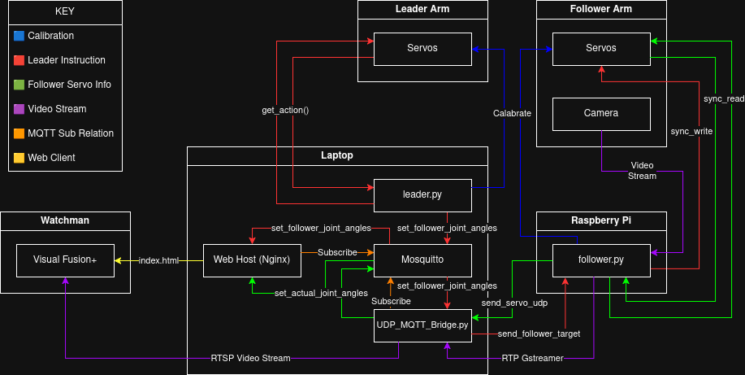

# SO-101 DIGITAL TWIN

NOTE: This project has been reverted to an older branch because the MQTT-to-UDP bridge is obsolete (Rinicom radios work with MQTT). Some previously fixed bugs or completed features may not work; if you hit major issues, please switch back to the deprecated branch (see the branches list).


This project was designed during my 4th year student work placement with Rinicom. If you have any questions that are not answered below, feel free to reach out to me at nialldorrington@btinternet.com.

## Project overview
The following codebase allows for real-time teleoperation and digital twin visualisation of the SO-101 robot arms.

You will need:
- SO-101 Leader and follower arms (See SO-101 Robot Arm Details and Maintenance)
- Raspberry Pi (recommended), or another device to connect the follower arm
- Linux host device (e.g. laptop) for hosting the front-end and sending leader MQTT updates
- (Optional) Another host device for hosting the Visual Fusion+ video wall (Watchman)
- NOTE: The system can be set up with only one host device that also runs the Visual Fusion+ video wall, but the setup guide assumes a separate device is being used.

This project was made with the goal of taking it down a mineshaft, hence why a separate Raspberry Pi is connected to the follower SO-101 arm.

## Setup 
For a detailed breakdown of how to set up the system, see [docs/SETUP.md](docs/SETUP.md).

## Usage Guide
For a detailed breakdown of how to use the system once it is set up, see [docs/USAGE.md](docs/USAGE.md).

## Project Discription and System Justifications

Now that you have the system up and running and hopefully understand how to use it, below I will go into more detail about the codebase. This should provide a more technical description of system choices, helping with future development or adapting it for future projects.

The code base is broken down into:
- front-end: HTML & JS for the web digital twin
- lerobot: Code taken from the open-source LeRobot repo: https://github.com/huggingface/lerobot
- scripts: Custom Python scripts for the SO-101 leader, follower, and camera that run on the Pi and host device

Here's a diagram showing the data flows (this might cause more confusion, I promise it's not as complicated as it looks):



And here is the format of the MQTT JSON payloads:
```json
{
  "id": "unique-message-id",
  "method": "set_follower_joint_angles",
  "timestamp": "2026-01-14T15:27:05Z",
  "params": {
    "joints": {
      "shoulder_pan.pos": 0,
      "shoulder_lift.pos": 0,
      "elbow_flex.pos": 0,
      "wrist_flex.pos": 0,
      "wrist_roll.pos": 0,
      "gripper.pos": 0
    }
  }
}
```

### Features

- Calibration ensures that the follower arm will not attempt to move past servo limits, avoiding damage.

- The current system's follower will handle dropped packets by moving in safe increments towards the last received leader position and periodically sending arm states while idle.

- When an MQTT request is stale for either leader or follower (last send was over 5 seconds ago), the relevant digital twin will go red, indicating an error/inaccurate current display.

- In cases of low bandwidth, RTP video packets are dropped in favour of servo instructions and feedback.

- After monitoring using `/scripts/monitor_udp.py` for 15 minutes of constant leader arm movement updates to the follower, the total average Kbps was 768.43.


## SO-101 Robot Arm Details and Maintenance 

A full guide on the SO-101 robot arms can be found in the README here: https://github.com/TheRobotStudio/SO-ARM100. This includes documentation, bill of materials, and links to pre-built arms that are available to purchase.

- NOTE: As of 17/03/2026 the current Rinicom leader arm gripper servo is a little damaged. So far it works fine but has some resistance and a "crunch" when extended around 90°. The servo needed to replace this was identified from the above link as STS3215 Servo 7.4V, 1/147 gear (C046).

- NOTE: As of 18/02/2026 the USB-C port on the follower arm came off and had to be re-soldered. It clearly seems like the original soldering job wasn't great, so be careful with other connections, especially the USB-C port on the leader arm as it's probably the same.
