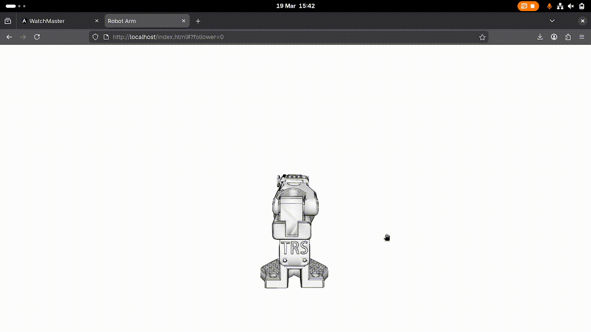
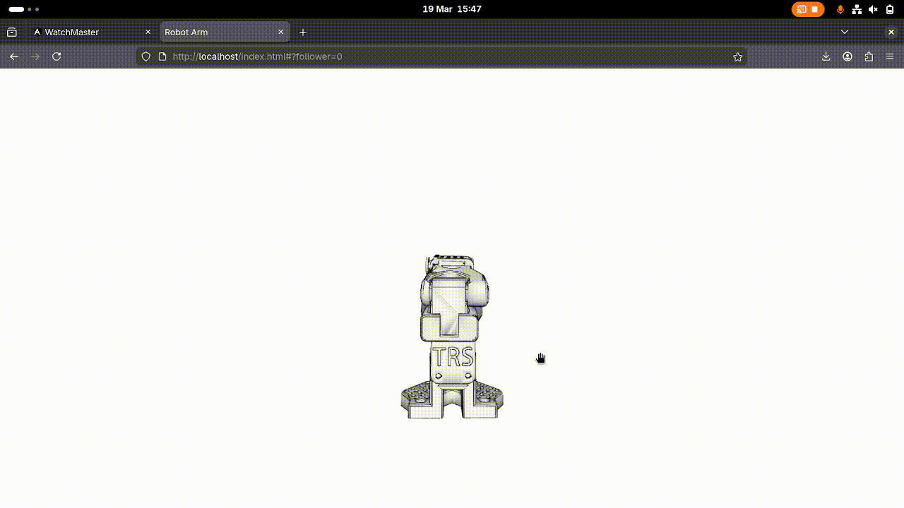
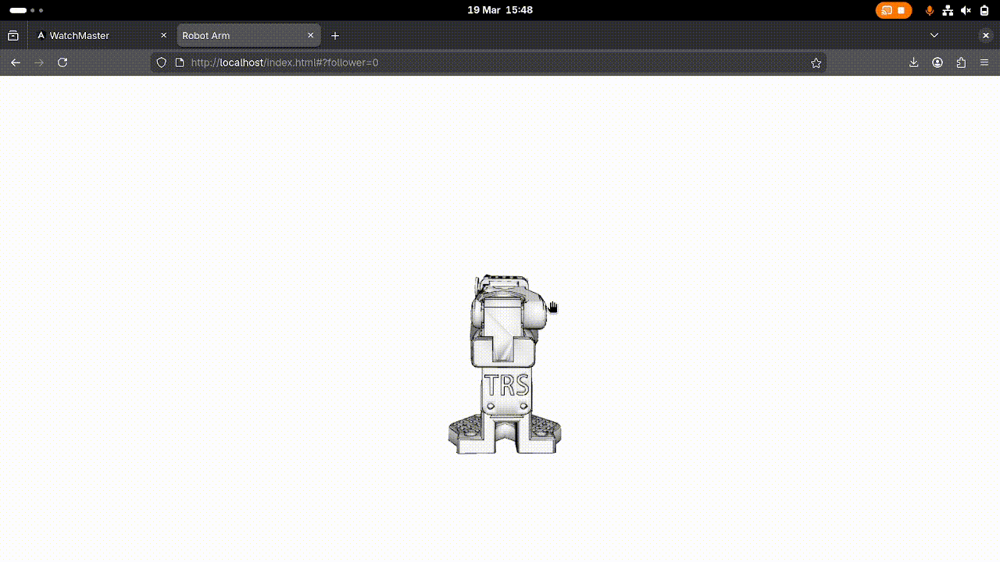

## Front-end 3D camera guide

`front-end/index.html` can be used to move around the Three.js camera around the digital twin, detailed below.

### Controls

**Rotate (orbit)**: left-click and drag

**Pan**: right-click and drag

**Zoom**: mouse wheel scroll (or pinch on a trackpad)

### Locking Cameras

These cammera changes have their own MQTT topic ("change-camera") so all instances of the front-end will be in sync. 

However in certain usecases you may want to have multiple different rotations/zooms of the digital twin on your video wall. 
For this you can use the URL cam parameters mentioned in [USAGE.md](USAGE.md).
If any camera value is set within the URL the MQTT camera position updates will be ingnored "Locking" the camera.

#### Examples:
(These are on Watchman Profile "SO-101 Digital Twin" Scene 2, for you to play around with if my bad text discriptions dont make any sense)

Here is an example camera that gives a top down view
`http://<WEB_HOST_IP>/index.html?#camY=8`
As the camera is 8 units on the Y axis (up) and all the other cam axis and cam target axis default to 0 its 8 units up and looking at 0, 0, 0 (where the robot arm is loaded) 

Here is and example camera that gives us a side on view
`http://192.168.1.107/index.html?#camX=3&camY=1.5&camTargetY=1.5`
As the camera is 3 units along on the X axis we view the model on that side from 3 units away.
We also can shift the camera up by 1.5 on the Y axis and move the camTargetY axis up the same amount, to get the model slightly closer to the bottom of the screen whilst still being straight on sideways.